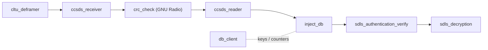

# gr-soarr

A GNU Radio out-of-tree module implementing the ground-station side of a
CCSDS Telecommand (TC) uplink for ARIS's SOARR mission: encode, secure,
frame, and transmit a telecommand on TX, and detect, correct, verify, and
decrypt it again on RX.

All 20 blocks are pure Python and appear in GNU Radio Companion under the
**[soarr]** category.

## Features

- **CCSDS layering end to end** — encapsulation packet (CCSDS 133.1-B),
  TC transfer frame (CCSDS 232.0-B), pseudo-randomization, BCH (63,56)
  coding and CLTU framing (CCSDS 231.0-B).
- **SDLS security** (CCSDS 355.0-B-1) — AES-256-CTR encryption,
  AES-CMAC authentication, and the SDLS security header (SPI + IV).
- **Key and counter management** — keys, SPIs, and per-frame counters come
  from a lookup block backed by an in-memory entry or a YAML file.
- **Full RX path** — CLTU detection, BCH error correction, frame
  reassembly, parsing, tag verification, and decryption.
- **Loopback testing** — a payload generator and a tester reporting bit
  error rate, message error rate, and lost packets.

## Signal chains

### TX

```mermaid
flowchart LR
    db["db_client"] -. keys / counters .- inj["inject_db"]
    inj --> enc["encapsulation_header"] --> crypt["sdls_encryption"]
    crypt --> auth["sdls_authentication"] --> sh["sdls_header"]
    sh --> tc["tc_primary_header"] --> crc["crc_append (GNU Radio)"]
    crc --> scr["lfsr_scrambler"] --> bch["bch_encoder"]
    bch --> cltu["cltu_framer"] --> seq["acquisition_idle_sequencer"]
```



### RX



`acquisition_idle_sequencer` is the only stream block; it turns the framed
PDUs into a continuous byte stream for the modulator. Every other block
passes PDUs as messages. See [docs/architecture.md](docs/architecture.md)
for the full pipeline description.

## Blocks

| Block | GRC category | Purpose |
|---|---|---|
| `inject_db` | Database | Queries `db_client` and merges the returned keys and counters into each PDU's metadata |
| `db_client` | Database | Serves keys, SPIs, and counters by SCID + SPI from an in-memory entry or a YAML file |
| `encapsulation_header` | Encapsulation | Prepends the CCSDS encapsulation packet header |
| `sdls_encryption` | SDLS | Encrypts the payload with AES-256-CTR |
| `sdls_authentication` | SDLS | Appends an AES-CMAC authentication tag |
| `sdls_header` | SDLS | Prepends the SDLS security header (SPI + IV) |
| `tc_primary_header` | Telecommand | Builds the 5-byte TC transfer frame primary header |
| `lfsr_scrambler` | LFSR | Applies the CCSDS TC pseudo-randomizer |
| `bch_encoder` | CLTU | Splits the frame into BCH (63,56) codewords |
| `cltu_framer` | CLTU | Wraps codewords in the CLTU start and tail sequences |
| `acquisition_idle_sequencer` | (root) | Adds acquisition/idle sequences and outputs a continuous byte stream |
| `cltu_deframer` | CLTU | Finds CLTUs in the received stream |
| `ccsds_receiver` | Reception | BCH-corrects, de-randomizes, and reassembles TC transfer frames |
| `ccsds_reader` | Reception | Parses a reassembled frame into its header fields and payload |
| `sdls_authentication_verify` | SDLS | Verifies and strips the AES-CMAC tag |
| `sdls_decryption` | SDLS | Decrypts the payload with AES-256-CTR |
| `bch_decoder` | CLTU | Standalone BCH (63,56) decoder (corrects up to 2 bit errors) |
| `lfsr_descrambler` | LFSR | Standalone de-randomizer |
| `data_creator` | Testing | Generates test payloads |
| `system_tester` | (root) | Measures bit error rate, message error rate, and lost packets in a loopback |

`bch_decoder` and `lfsr_descrambler` are also used internally by
`ccsds_receiver`; they are exposed separately for testing individual
layers. Each block has a requirements document in [docs/prd/](docs/prd/).

## Requirements

- GNU Radio 3.10 — developed and tested with 3.10.12 from
  [radioconda](https://github.com/ryanvolz/radioconda)
- CMake 3.16 or newer
- A C/C++ compiler (GCC, Clang, MSVC)
- Python packages from [requirements.txt](requirements.txt): `construct`,
  `PyYAML`, `pycryptodome`, `numpy`, and `pytest` for the tests

## Installation

Clone the repository, then install into your GNU Radio conda environment.

**Windows (PowerShell):**

```powershell
conda activate radioconda
pip install -r requirements.txt
.\tools\install_gr_soarr.ps1
```

**Linux / WSL** (Ubuntu shown; with a conda env, activate it and use
`pip install -r requirements.txt` instead of `apt`):

```bash
sudo apt install gnuradio gnuradio-dev cmake g++ \
    python3-construct python3-yaml python3-pycryptodome python3-pytest
./tools/install_gr_soarr.sh --sudo-install
```

Both scripts configure, build, and install the module into the active
environment. To run the CMake steps yourself instead:

```bash
cmake -S . -B build
cmake --build build --config Release
cmake --install build --config Release
```

CMake picks its default generator and whichever compiler it finds; add
`-G "<generator>"` to the first command to choose a specific one.

Afterwards, restart GNU Radio Companion; the blocks appear under
**[soarr]**. Script options, VS Code setup, and troubleshooting are in
[docs/development.md](docs/development.md).

## Usage

In GNU Radio Companion, wire the blocks as shown in the chains above. From
Python:

```python
from gnuradio import soarr

help(soarr)                # package overview
help(soarr.cltu_framer)    # ports, parameters, and PDU shapes of one block
```

[examples/db_client_example.yaml](examples/db_client_example.yaml) is an
example key/counter database for `db_client`; see
[examples/README](examples/README) for its format.

## Tests

```powershell
conda activate radioconda
pytest python/soarr -q
```

The suite covers every block individually plus TX/RX chain and
encrypt/decrypt, authenticate/verify round trips.

## Roadmap

- **Telemetry (TM)** — the downlink counterpart to TC is the next step.
  Only telecommand is implemented today; `ccsds_receiver` already has a
  TM message type option, but selecting it does not process frames yet.

## Known issues

- `db_client`'s `auto_reset_counters` option (in-memory test mode) wraps
  the SDLS counter back to 0, which reuses AES-CTR counters under the
  same key. Never enable it with real key material.

Open design questions and test-coverage gaps are listed in
[docs/to-do.md](docs/to-do.md).

## Documentation

| Document | Contents |
|---|---|
| [docs/architecture.md](docs/architecture.md) | TX/RX pipeline and block roles |
| [docs/development.md](docs/development.md) | Build, install, test, and tooling setup |
| [docs/coding-standards.md](docs/coding-standards.md) | Naming, error handling, docstring, and commit rules |
| [docs/adr/](docs/adr/) | Architecture decision records |
| [docs/prd/](docs/prd/) | One requirements document per block |
| [docs/to-do.md](docs/to-do.md) | Known bugs and open design questions |

## License

GPL-3.0-or-later — see [LICENSE](LICENSE).
