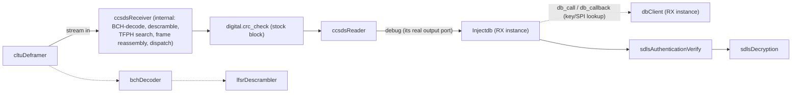

# Architecture

Pipeline diagrams and block roles for gr-soarr. Domain terms (TC, CLTU, BCH,
SDLS, SPI, IV, etc.) are defined once in [CONTEXT.md](../CONTEXT.md) — not
repeated here.

**Naming note:** every block below is named as it exists on disk today
(camelCase, e.g. `ccsdsReader`). [ADR-0001](adr/0001-block-naming-convention.md)
decided a target snake_case naming (`ccsds_reader`) — that rename has **not**
been executed yet. This diagram describes the codebase as it actually is,
not the target state.

## Legend

| Style | Meaning |
|---|---|
| Plain box | Message-passing block (`gr.basic_block`, PDU in/out) — the default shape for this module |
| Box tagged "(stream block)" | The one block with a real `out_sig` (`gr.sync_block`) |
| Box tagged "(stock block)" | Stock GNU Radio block, not part of gr-soarr |
| Dashed connector | Internal primitive path — GRC-exposed for testing, not part of the public pipeline ([ADR-0005](adr/0005-rx-path-canonical-block.md)) |

## TX chain

Confirmed via `python/soarr/qa_layoutTest.py`'s `msg_connect` wiring
(lines 89–101), and independently confirmed end-to-end by a working
external flowgraph (`CCSDS_Full.grc` — see Known Gaps):

```mermaid
flowchart LR
    dbClient["dbClient"]
    Injectdb["Injectdb"]
    encapsulationHeader["encapsulationHeader"]
    sdlsEncryption["sdlsEncryption"]
    sdlsAuthentication["sdlsAuthentication"]
    sdlsHeader["sdlsHeader"]
    tcPrimaryHeader["tcPrimaryHeader"]
    crcAppend["digital.crc_append (stock block)"]
    lfsrScrambler["lfsrScrambler"]
    bchEncoder["bchEncoder"]
    cltuFramer["cltuFramer"]
    aqusitionIdleSequencer["aqusitionIdleSequencer (stream block)"]

    Injectdb -. "db_call / db_callback (key/SPI lookup)" .-> dbClient
    Injectdb -- out --> encapsulationHeader
    encapsulationHeader --> sdlsEncryption
    sdlsEncryption --> sdlsAuthentication
    sdlsAuthentication --> sdlsHeader
    sdlsHeader --> tcPrimaryHeader
    tcPrimaryHeader --> crcAppend
    crcAppend --> lfsrScrambler
    lfsrScrambler --> bchEncoder
    bchEncoder --> cltuFramer
    cltuFramer --> aqusitionIdleSequencer
```

`dbClient` is a query/response side-channel off `Injectdb` (`db_call`/
`db_callback` ports) — not a parallel input into the main chain. Only
`Injectdb`'s `out` port feeds `encapsulationHeader`.

Order is encrypt-then-authenticate (`sdlsEncryption` before
`sdlsAuthentication`) — confirmed, not open.

`aqusitionIdleSequencer` bridges `cltuFramer`'s PDU output to a continuous
byte stream for the SDR/modulator downstream. It's the only stream block
in this module (`gr.sync_block`, `out_sig=[np.uint8]`) — every other block
above is `gr.basic_block`, message-passing only.

## RX chain

`ccsdsReceiver` is the one canonical, documented RX path
([ADR-0005](adr/0005-rx-path-canonical-block.md)) — it imports `bchDecoder`
and `lfsrDescrambler` directly as Python helpers and calls them internally,
alongside frame reassembly and TFPH search logic that exists nowhere else.

`digital.crc_check` sits between `ccsdsReceiver` and `ccsdsReader`,
checking the FECF — the RX-side counterpart to TX's `digital.crc_append`.
It has two output ports, `fail` and `ok`; in the confirmed external
flowgraph both are wired to `ccsdsReader`'s input. That's how the
flowgraph was left, not a documented design decision — don't read
architectural intent into it.

`ccsdsReader`'s output port is named `debug`, but it's actually its real,
only output — not a diagnostic-only tap (confirmed: it's wired onward to
the next block in the working flowgraph, not just to a debug sink).

A second `Injectdb`/`dbClient` pair sits between `ccsdsReader` and
`sdlsAuthenticationVerify`, mirroring the TX-side key lookup — presumably
fetching the SDLS key material needed for verification and decryption.

The dashed `cltuDeframer → bchDecoder → lfsrDescrambler` path (bottom) is a
separate, standalone GRC-wireable chain, exercised only by
`qa_lfsr_receive_chain.py`. It is **not** a substitute RX path — it stops
at the physical/FEC layer and never reaches frame reassembly or TFPH
search. It stays GRC-exposed as an internal primitive, useful for isolating
bugs at exactly that layer.

### SDLS verify-then-decrypt order — confirmed

The order shown above (`sdlsAuthenticationVerify` before `sdlsDecryption`)
is required by the crypto construction: `sdlsAuthenticationVerify`'s CMAC
tag is computed over the still-encrypted bytes; `sdlsDecryption`'s AES-CTR
transforms those same bytes. Decrypting first would break tag verification
for any real payload.

This order is also confirmed by direct wiring in a working external
flowgraph (`sdlsAuthenticationVerify.out → sdlsDecryption.in`) — not just
by the crypto argument. That flowgraph isn't in this repo yet (see Known
Gaps), so there is still no in-repo `.grc` example or QA test proving this
order; treat it as confirmed-in-practice but not yet self-verifying from
this repo alone.

## Ground-tooling (not signal chain)

- **`systemTester`** — round-trip verification. Compares original vs.
  received payloads out-of-band, at the end of the pipeline; it does not
  sit inline in either chain and has no per-block error-signal port to
  depend on.
- **`dataCreator`** — synthetic payload generator, an alternative to the
  `Injectdb`/`dbClient` DB-backed path for generating TX payloads. Only one
  of the two is needed at a time, not both.

## Known gaps

- No example `.grc` flowgraph exists **in this repo** for the full TX or
  RX chain (`examples/dbClient_example.yaml` is a YAML *data* file for
  `dbClient`'s type=1 config mode, not a flowgraph). A working example
  does exist outside the repo (`CCSDS_Full.grc`, built with this OOT
  module, plus `DataFlow_TX.drawio.xml`/`DataFlow_RX.drawio.xml`) and is
  intended to become an in-repo example — it currently uses pre-rename
  `sage_*` block IDs and needs updating before it can be added.
- No `LICENSE` file; `MANIFEST.yml` has blank `license`/`repo`/`website`
  fields — a real pre-public-release blocker, noted here but not resolved
  as part of this documentation step.
- Per-block detail (message port PDU shapes, parameters, edge cases) lives
  in `claude/prd/<block>.md` — not yet written (Step 4 of the parent plan).
