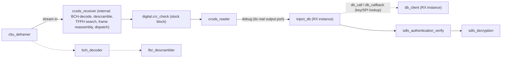

# Architecture

Pipeline diagrams and block roles for gr-soarr. Domain terms (TC, CLTU, BCH,
SDLS, SPI, IV, etc.) follow their CCSDS definitions. Per-block detail
(message ports, PDU shapes, parameters, edge cases) lives in
[prd/](prd/), one file per block.

**Naming note:** every block below uses its current snake_case name, per
[coding-standards.md](coding-standards.md) ([ADR-0001](adr/0001-block-naming-convention.md)).

## Legend

| Style | Meaning |
|---|---|
| Plain box | Message-passing block (`gr.basic_block`, PDU in/out) — the default shape for this module |
| Box tagged "(stream block)" | The one block with a real `out_sig` (`gr.sync_block`) |
| Box tagged "(stock block)" | Stock GNU Radio block, not part of gr-soarr |
| Dashed connector | Internal primitive path — GRC-exposed for testing, not part of the public pipeline ([ADR-0005](adr/0005-rx-path-canonical-block.md)) |

## TX chain

Confirmed via `python/soarr/qa_tx_chain.py`'s `msg_connect` wiring
(lines 89–101), and end to end by the example flowgraphs in
[`examples/`](../examples/) (`tc_loopback_sim.grc` runs TX → RX in
software):

```mermaid
flowchart LR
    dbClient["db_client"]
    Injectdb["inject_db"]
    encapsulationHeader["encapsulation_header"]
    sdlsEncryption["sdls_encryption"]
    sdlsAuthentication["sdls_authentication"]
    sdlsHeader["sdls_header"]
    tcPrimaryHeader["tc_primary_header"]
    crcAppend["digital.crc_append (stock block)"]
    lfsrScrambler["lfsr_scrambler"]
    bchEncoder["bch_encoder"]
    cltuFramer["cltu_framer"]
    aqusitionIdleSequencer["acquisition_idle_sequencer (stream block)"]

    Injectdb -. "db_call / db_callback (key/SPI lookup)" .-> dbClient
    Injectdb -- out --> encapsulationHeader
    encapsulationHeader --> sdlsEncryption
    sdlsEncryption --> sdlsAuthentication
    sdlsAuthentication --> sdlsHeader
    sdlsHeader --> tcPrimaryHeader
    tcPrimaryHeader --> crcAppend
    crcAppend --> lfsrScrambler
    lfsrScrambler --> bchEncoder
    bchEncoder --> cltuFramer
    cltuFramer --> aqusitionIdleSequencer
```

`db_client` is a query/response side-channel off `inject_db` (`db_call`/
`db_callback` ports) — not a parallel input into the main chain. Only
`inject_db`'s `out` port feeds `encapsulation_header`.

Order is encrypt-then-authenticate (`sdls_encryption` before
`sdls_authentication`) — confirmed, not open.

`acquisition_idle_sequencer` bridges `cltu_framer`'s PDU output to a
continuous byte stream for the SDR/modulator downstream. It's the only
stream block in this module (`gr.sync_block`, `out_sig=[np.uint8]`) —
every other block above is `gr.basic_block`, message-passing only.

## RX chain

`ccsds_receiver` is the one canonical, documented RX path
([ADR-0005](adr/0005-rx-path-canonical-block.md)) — it imports
`bch_decoder` and `lfsr_descrambler` directly as Python helpers and calls
them internally, alongside frame reassembly and TFPH search logic that
exists nowhere else.

`digital.crc_check` sits between `ccsds_receiver` and `ccsds_reader`,
checking the FECF — the RX-side counterpart to TX's `digital.crc_append`.
It has two output ports, `fail` and `ok`; in the confirmed external
flowgraph both are wired to `ccsds_reader`'s input. That's how the
flowgraph was left, not a documented design decision — don't read
architectural intent into it.

`ccsds_reader`'s output port is named `debug`, but it's actually its real,
only output — not a diagnostic-only tap (confirmed: it's wired onward to
the next block in the working flowgraph, not just to a debug sink).

A second `inject_db`/`db_client` pair sits between `ccsds_reader` and
`sdls_authentication_verify`, mirroring the TX-side key lookup —
presumably fetching the SDLS key material needed for verification and
decryption.

The dashed `cltu_deframer → bch_decoder → lfsr_descrambler` path (bottom)
is a separate, standalone GRC-wireable chain, exercised only by
`qa_lfsr_receive_chain.py`. It is **not** a substitute RX path — it stops
at the physical/FEC layer and never reaches frame reassembly or TFPH
search. It stays GRC-exposed as an internal primitive, useful for isolating
bugs at exactly that layer.

### SDLS verify-then-decrypt order — confirmed

The order shown above (`sdls_authentication_verify` before
`sdls_decryption`) is required by the crypto construction:
`sdls_authentication_verify`'s CMAC tag is computed over the
still-encrypted bytes; `sdls_decryption`'s AES-CTR transforms those same
bytes. Decrypting first would break tag verification for any real payload.

The example flowgraphs wire it this way
(`sdls_authentication_verify.out → sdls_decryption.in`), and
`tc_loopback_sim.grc` delivers every payload byte-identical with
authentication on.

## Ground-tooling (not signal chain)

- **`system_tester`** — round-trip verification. Compares original vs.
  received payloads out-of-band, at the end of the pipeline; it does not
  sit inline in either chain and has no per-block error-signal port to
  depend on.
- **`data_creator`** — synthetic payload generator, an alternative to the
  `inject_db`/`db_client` DB-backed path for generating TX payloads. Only
  one of the two is needed at a time, not both.

## Known gaps

- **Encryption and encapsulation are undone in the wrong order on RX.**
  TX adds the encapsulation header first and then encrypts header and
  payload together (`encapsulation_header → sdls_encryption`). On RX,
  `ccsds_reader` parses and strips the encapsulation header *before*
  `sdls_decryption` runs, so it reads ciphertext as a header, strips a
  wrong number of bytes, and decryption then runs on a shifted slice.
  `sdls_authentication_verify` still passes, because the CMAC covers the
  ciphertext it rebuilds. With encryption off the chain round-trips
  byte-identical; with it on, no payload is recovered correctly. Fixing
  it means removing the encapsulation header only after decryption — see
  [to-do.md](to-do.md).
